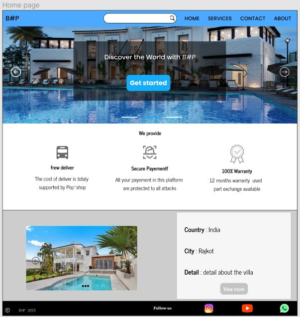

# branch-pratice
In this project we are going to work using :
## HTML
## CSS
## JAVASCRIPT

<h5>Description <h5>
This is just for our pratice on github

<h2>Design of website <h2>

    <dl>
        <dt>Home</dt>
        <dd></dd>
    </dl>
  

